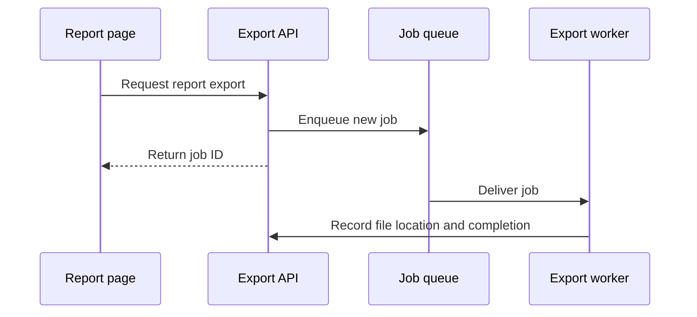

# PR Body Writing Guide

Use this local guide when composing or revising a PR description on either
publication path. The scope, proof, and readiness requirements in `SKILL.md`
and the applicable repository template still govern publication.

## Choose the explanation

Start with the problem and resulting behavior in the project's own terms.
Explain the final change for a reviewer who has not seen the conversation.
A straightforward change may need only a few sentences and validation.

Add a sketch when it answers a question that prose leaves hard to follow.

## Human review after merge

For a PR selected under
[Delivery and Human Review](../../engineering-for-certainty/references/delivery-and-human-review.md),
make the first screen enough to understand the change and choose where to look.
Prefer a short problem/result statement, the reason for human review, and a few
linked code entry points or contracts. Add a small before/after example,
screenshot, diagram, or comparison table when it conveys the idea faster than
prose. Explain necessary technical terms at the point of use.

Keep consequential implementation choices, verified behavior, remaining risks,
and recovery limits easy to find. Link detailed reasoning and raw evidence;
use collapsible detail when the hosting surface supports it. Scale the format
to the change instead of requiring six long sections or a fixed report. Keep
the repository queue entry to a link, brief description, and review reason or
focus; the PR is the guided review surface.

Illustrative opening (replace placeholders with verified links and results):

> **Change:** Permission checks now use one shared function.
> **Why review:** This affects access across customer API routes.
> **Start here:** Permission function → route integration → isolation tests.
> **Evidence:** Cross-customer access was denied; permitted actions still passed.
> **Watch for:** Exceptions that should remain specific to individual routes.

Keep tested revision and environment with linked evidence. After merge, record
the resulting merge/squash revision and known deployment state on the same PR.
Do not present an expected result as observed, or a later live deployment as
the exact version reviewed. Reuse the issue evidence index without duplicating
it. A compact explanation never replaces required proof.

## Explanation forms

Choose by what the reviewer needs to understand:

| Reviewer needs to understand | Useful form |
| --- | --- |
| A decision, condition, or algorithm | Pseudocode |
| The order of calls within a process | Call tree |
| UI nesting and ownership of state or actions | Component tree |
| How responsibilities move between files | Shallow file tree |
| Exchanges between components, services, or processes | Mermaid |
| What changed within a familiar structure | Diff sketch |
| A mostly new block, or context a diff would obscure | Complete block |

Use only the forms that add information. Keep enough context to reveal order,
ownership, and relevant conditions. Place the sketch next to its explanation.
Do not turn a simplified sketch into a claim that omitted paths do not exist.
Include real repository-relative paths or symbol names when they help reviewers
locate the implementation; omit private machine paths.

The examples below are original, illustrative export-workflow examples. They
are not implementation instructions or evidence that any checks have run.
Adapt the form to the actual diff and verified handoff.

## Pseudocode: reveal a decision

Use pseudocode when branching behavior matters more than language syntax.
For example, a repeated export request now reuses an active job:

```text
request export for this report and these options
  find a matching active job
  if found
    return that job's ID
  otherwise
    create and enqueue a new job
    return the new job's ID
```

Name the matching condition when it changes the result. Here, sharing a report
alone is insufficient: the options must match too.

## Call tree: reveal execution order

Use a call tree for a path within one process. Label the path if the tree omits
branches. For the new-job path in the export handler:

```text
requestReportExport
  validateExportOptions
  findActiveExport -> none
  createExportJob
  enqueueExportJob
  returnJobId
```

This makes the enqueue step's position visible. It does not explain worker
execution; add that only if the worker is part of the change.

## Component tree: reveal UI ownership

Use a component tree when nesting, state ownership, or action ownership is the
point. Include those responsibilities rather than just listing components:

```text
<ReportPage>                 owns the selected report and export job ID
  <ExportOptionsForm>        edits format and date range
  <ExportButton>             requests the export
  <ExportStatus jobId>       displays progress for the selected job
    <DownloadLink>           appears when that job completes
```

Verify these ownership claims against the actual components and hooks. A UI
tree explains structure; screenshots demonstrate the visible result.

## File tree: reveal responsibilities

Use a shallow file tree for a refactor whose main effect is where code belongs:

```text
exports/
  request.ts       validates requests and selects or creates a job
  repository.ts    reads and writes export job records
  worker.ts        produces the export file
```

Show only files that explain the boundary. Include why responsibilities moved
when a tree alone would leave the refactor's purpose unclear.

## Mermaid: reveal interactions

Use Mermaid when the important behavior crosses participants. For a new job:



Label messages with real domain actions. Verify direction, order, and whether
messages are requests, responses, or asynchronous delivery. Keep unrelated
infrastructure out of the diagram.

## Diff sketch: reveal the change

Use a diff sketch when surrounding behavior is already familiar and the edit
is the main point. This is a simplified behavioral diff, not a literal patch:

```diff
 requestExport(report, options)
-  create and enqueue a job
+  find an active job matching report and options
+  reuse its ID if found
+  otherwise create and enqueue a job
   return the job ID
```

A diff sketch can also show a component insertion, moved file responsibility,
or reordered call. Keep enough unchanged context to make its location clear.
Use actual patches when precise syntax is essential; simplified sketches must
remain faithful to the reviewed implementation.

## Complete block: preserve necessary context

Show a complete block when most of it is new, omitted context hides ownership
or order, or the final shape is easier to assess together. For example, if the
whole selection helper is new, show its full decision structure:

```text
selectExportJob(report, options)
  validate options
  find an active job for the same report and options
  if found
    return existing job
  create a new job
  enqueue the new job
  return new job
```

Use a full code block rather than pseudocode when exact syntax or the copyable
target is the point. A block explaining control flow does not by itself prove
concurrency safety or justify implementation details omitted from the sketch.

## Present observed evidence

Connect evidence to the behavior it establishes. For visible changes, pair
screenshots of the relevant state when available. For runtime behavior, pair
the same scenario's observed results before and after, using actual test
results or execution output. Explain conditions when they affect comparison.

Retain the exact command or scenario, tested revision, environment, and result
from the verified handoff. Link the evidence artifact when it is useful and
safe to share. A pseudocode explanation of a test is not a test run.

If no baseline run or screenshot exists, report the observed candidate result
and identify the missing baseline when material. Do not reconstruct it as a
captured failure. An illustration or expected result must be labeled as such.
Reuse evidence; missing required proof returns to the owning workflow rather
than being supplied by more convincing prose.

## Explain impact and recovery

For a material risk, say who or what is affected, how the failure could occur,
and what recovery actually restores. For example, a worker rollout might
affect new exports while leaving existing download links intact. Explain that
boundary only when the implementation and handoff support it.

Distinguish reverting code from restoring data or undoing external effects.
If rollback would leave records unreadable, delete results, or repeat an
external action, name the limitation and the required backup, recovery, or
roll-forward procedure. For straightforward reversible changes, a short
explanation is enough. Use concrete effects instead of unsupported risk grades.

## Example of a compact PR description

This fictional example assumes the named observations and checks actually
exist in its handoff. Its headings and content illustrate one useful shape;
they are not a mandatory template. Actual PRs must use their own evidence and
include every applicable repository or publication requirement.

````markdown
Repeated export clicks create duplicate jobs for the same report and options.
The handler now returns the matching active job's ID so those clicks share one
export. A completed export does not prevent a later request from starting a job.

### Change

```text
request -> match active job -> reuse ID
                          -> otherwise create and enqueue job
```

### Evidence

- Before: the repeated-request scenario returned two job IDs.
- After: it returned one shared ID; different options still created separate jobs.
- Validation: pnpm test -- export-request.test.ts — 6 tests passed.
- Tested revision: fc39a81, local test environment.
- Concurrent requests were not exercised by this scenario; this change does
  not claim protection against that race.

### Impact and recovery

Only active-job selection in the export request handler changes. Reverting
restores the previous selection behavior; jobs already queued remain queued.
````

In a real handoff, an untested scenario that is required by the change's scope
blocks readiness. Calling out that gap in the body does not waive the gate.
